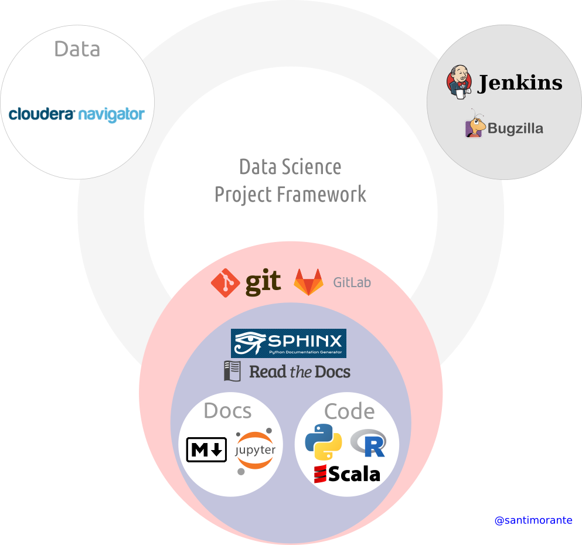

# Reproducible Data Science (a practical approach)
This proposal aims to show a comprehensive methodology and framework to tackle Big Data analytical problems. Data Science is a recent area fostered by recent advances in computation, and the availability of massive datasets about nearly everything. This fact makes the field a little immature with respect to experiment protocols, process tracking and reproducibility of results.

For any scientific problem, and also in Data Science, it is important to keep track of the experiments (who did this, where it came from, how it was done, what data was used, what model was trained, etc). It is also important to ensure the reproducibility of the results to be able to repeat an experiment with the same data and the same model. 

Next, let's see a practical guide on how to complete an analytics Big Data problem with rigor and safety.

## Version control
A version control system is an automated tool that keeps track of any change performed on a set of files (be it data, models, documentation, etc). **It is indispensable to have a version control system in any Data Science project**. A complete analytical project is composed of:

    <b>
        Data + Code + Documentation
    </b>

Moreover, each of these items can be decomposed into sub-items.
  
* **Data**: 
    * Raw data
    * Cleaned data
    * Enriched data
    * Normalized data
    * Training data
    * Validation data
    * Test data
 
* **Code**:
    * Extraction, transformation and loading
    * Cleaning
    * Enrichment
    * Normalization
    * Dimensionality reduction and variable selection
    * Modeling (training)
    * Prediction
    * Results generation

* **Documentation**:
    * Raw data information: semantic model, data source origin, field description
    * Cleaning process
    * Enrichment process
    * Normalization process
    * Dimensionality reduction and variable selection process
    * Sampling performed on data to split in training, validation and test blocks
    * Model used and parameters set
    * Results generated and model score

Every time an experiment is performed, that is, every time a model is trained or a model is used to predict on data, all the information (ideally data, code and documentation) must be stored together. This package must also be tagged with date and time of the experiment, the user who run the experiment, and any other tag that is considered necessary. 

However, in real life, data is kept blocked and cannot be extracted from the storage platform, as it is a precious value for the company. In these cases, the documentation must include an explicit reference to the data used (tables in Hive, files in HDFS, etc).

### Tentative tools

The most used version control system currently is [**Git**](https://git-scm.com/). If you are using an integrated analytical tool, make sure it includes a version control system. 

## Documentation
Big analytical projects generate lots of code, many unsuccessful models, and branches to test new ideas. To understand an analytical solution, and also to facilitate non-members of the project to understand what was done, it is important to document every step of the process.

In order to generate good documentation, a project must include:

* Raw data information: semantic model, data source origin, field description
* Cleaning process: variables deleted, blank cell imputation, wrong characters substitution, etc
* Enrichment process: new sources used, how to integrate them in the dataset
* Normalization process: scaling method used (it will probably be different for each column), ranges used (if applicable), how outliers are treated
* Dimensionality reduction and variable selection process: number of dimensions selected, transformed data reference
* Sampling performed on data to split in training, validation and test blocks: percentages, seed used for random processes
* Model used and parameters set
* Results generated and model score
* References to any dataset used or generated (a workflow diagram helps in this part)
* Tags identifying the datetime of each experiment performed, and the author of the experiment

Another useful practice to document projects is to establish an standard folder structure for all the analytical projects. I propose the following folder tree:

* Project
    * docs
        * tutorials
        * results
    * src
    * models
        * superseded
        * current
    * data
    * README
    * LICENSE

The *docs* folder will include tutorials about the transformations suffered by the data from the source to the end results. It will also include the results themselves (pictures, etc)

The structure inside *src* will depend mostly on your programming language of election. It will contain the code for transformation, modeling and result generation.

In *models* there will be stored the serialized trained models, or the XML-like files needed to perfectly reconstruct a model to be used again. In order to avoid confusion, we can distinguish between current models being used and superseded ones (models with worse scores, model using a previous versions of the data, etc).

In *data* there will be stored the references to all the data used in the project.

It is also a good practice to include a *README* file explaining the folder tree, and a *LICENSE* file.

### Tentative tools

We can distinguish two types of documentation, that is, code documentation, and modeling documentation. For the former case, we can use traditional automatic code documentation tools like Sphinx:

* [**Sphinx**](http://www.sphinx-doc.org/en/1.4.8/):  is a documentation generator for code. It integrates perfectly with Git. It generates nice documentation systems, which can be modified with themes like  [**readthedocs**](http://docs.readthedocs.io/en/latest/theme.html). To allow Sphinx to document your code, it has to include specific comments on function sand classes.

For the latter, we can use markup documents and notebooks:

* [**Markdown**](https://github.com/adam-p/markdown-here/wiki/Markdown-Cheatsheet#links), [**rst**](http://docutils.sourceforge.net/rst.html): these are examples of markup languages with plain text formatting syntax designed so that they can be easily converted to HTML. Sphinx can read these types of files and create a webapp, and programs like RStudio or Jupyter notebooks allow exporting to these file formats. They can (and should) be also used to create user tutorials, readmes and execution instructions.

* **Notebooks**: the most used analytical languages (Python, R, Scala) can make use of notebooks. Notebooks are interactive computational environments in which you can combine code (and its output execution), formatted text, equations and figures. One famous notebook framework is [**Jupyter**](http://jupyter.org/) (there are others, like [**Zeppelin**](https://zeppelin.apache.org/)).

## Open code and open data

Analytics is not an easy field, and sometimes the work of a single data scientist alone may suffer from structural issues, or biases, that should be corrected. If a data scientist is working alone and nobody can see the code of the analysis, it is going to be very difficult to debug the problem. This is why it is important that each data scientist's code and the data used to train the models be accessible for a wide audience (as much as privacy and confidentiality allow it). Fellow data scientists can help improve the workflow or suggest new ideas for the project to obtain better results. Closed code age is over.

A couple of advices to tackle an analytical problem:

* During the project development, use a small random sample of the data. This will allow you to test new ideas quickly without waiting for hours for the code to finish
* Try new ideas in notebooks, explaining each step taken and why it is taken. Show the notebooks to fellows to validate your ideas
* Once you are confident enough with your workflow, code it or use your integrated tool to compose the system
* Run as many experiments as you wish, but tag the data and the code you used on each run (Git commits are of great help in this case)

### Tentative tools

In this case, opening the code and the data depends on your analytics platform and the permissions given by the system administrators.

* Collaborative tools like [**Dataiku DSS**](http://www.dataiku.com/) allow sharing workflows, code and data easily across organizations.

* If your business allows it, open platforms like [**Github**](https://github.com/) or [**Gitlab**](https://gitlab.com/) provide a wider audience for your analysis.

* Results can also be made public in platforms like [**Rpubs**](https://rpubs.com/) or [**Gitbooks**](https://www.gitbook.com/).

## Traceability and availability

A complex analytics project (most of them in the Big Data world) is composed by many steps (extraction, treatment, cleaning, enrichment, etc). These many steps can complicate the traceability of the project. The traceability is the ability to verify the history, location, source, or authority of an item (data or analysis) by means of documented recorded identification. This implies, for example, to be able to know what code generated what datasets and what models make use of this datasets. For the traceability to make sense, data and code used have to be also available.

* A good traceability system can be implemented using metadata over the data. This metadata should include: hardware and/or software system that physically contains the data, logical source of the data, code or executable that generated the data (if applicable), time and date of the generation, authorship, etc.

* Complementing metadata, the project should be supervised by logging systems. Logging is a very mature technology, so access by any process to any data must be registered (user access to data, modifications, etc). **It is completely indispensable in a Data Science project to ensure the non-modification of trained models**. Trained models can be used to generate economical benefits, so a malicious or unintentional modification of the model parameters may result in catastrophic consequences. Logs, logs, logs... and alarms in case of unauthorized access. 

### Tentative tools

The tools that enable to perform this kind of tracking are usually named data governance tools. A very complete suite is [**Cloudera Navigator**](http://www.cloudera.com/products/cloudera-navigator.html). It allows to track, classify, and locate data using metadata. Another option is [**Waterline Data**](http://www.waterlinedata.com/prod/).

## Reproducibility

**The aim is to be able to reproduce any experiment at any time in the future**. Another objective of this section is to enable benchmarkings among models, using the same test data.

* For those processes that require generating random numbers (many machine learning algorithms need them) is a good common practice to set a fixed seed for the random process. A seed is a number used to initialize a pseudo random number generator. When a seed is fixed, the pseudo random number generator always returns random numbers in the same order, so reproducibility is assured. The seed must be documented clearly, not only in the code, but also in the documentation.

* Related to the previous point, it is a good practice to save the parameters used to perform a random sampling or a random split on any dataset. When training a model, data is divided into training, evaluation and test, usually by random sampling a big initial dataset. This random sampling must be documented and the seeds specified.

* Models trained must be saved in a folder for latter evaluation or comparisons. For this methodology to be effective, each trained model must be tagged with the datetime, the training data used, and the evaluation data where it was applied.

### Tentative tools

In this case, to assure the reproducibility of experiments, the guides provided does not require special tools. The information can be included in the project documentation, using the tools already commented, the models can be kept, using the folder structure already specified, and versions can be recorded, using a version control systems mentioned.

## Automation

To facilitate the reproducibility of experiments, it is recommended to use automation tools that automatically:

* Compile the code
* Run unitary tests
* Check code quality
* Generate documentation

These tools usually integrate well with Git, by performing all the analysis once you commit your changes.

### Tentative tools

There are many tools of this type. They are commonly used in the production phase of projects, but it is advisable to include them also during the development phase. Let me name a few:

* [Jenkins](https://jenkins.io/) is an automation server that helps compiling the code.
* [SonarQube](http://www.sonarqube.org/) is a platform to automatically manage code quality and run unitary tests.
* A bug/issue tracking system, like [Bugzilla](https://www.bugzilla.org/), despite not being an automation tool *per se*, can be included to accelerate the process of solving issues within the project.

## The Final Picture
Let me recap all topics covered by using a picture. We can represent the best methodology in Data Science by means of the tools. The example represents a framework that would accomplish the gold standard methodology described.

    

        Santiago Morante, PhD  
        Data Scientist

*Special thanks to: [Tomas Morales](https://es.linkedin.com/in/tmoralesmorin), [Pablo Salinero](https://es.linkedin.com/in/pablo-salinero-ruiz-68741442), [Alfonso Ibañez](https://es.linkedin.com/in/fonsoim) y [Alvaro Alegria](https://es.linkedin.com/in/alvaroalegriameunier)*
